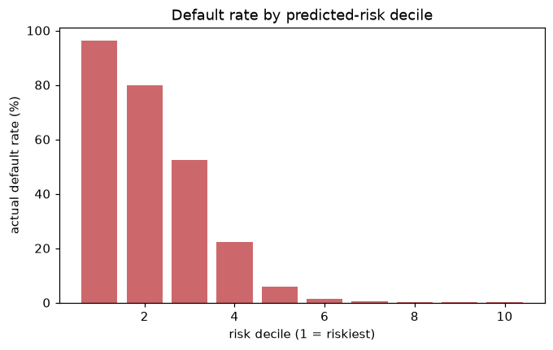
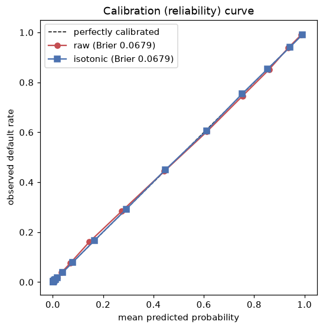

# American Express — Default Prediction

Predicting the probability that a credit-card customer will **default** on their
balance, using 13 months of anonymized monthly statement data. This repository
implements an end-to-end, memory-efficient machine-learning pipeline for the
[Kaggle *American Express - Default Prediction*](https://www.kaggle.com/competitions/amex-default-prediction)
competition and reports a strong, fully cross-validated **LightGBM baseline**.

> **Status:** End-to-end, **including deployment** — data → features → tuned
> GBDTs → credit-risk evaluation (calibration, SHAP, drift) → GRU sequence model
> → 3-way blend (OOF Amex 0.795) → a **calibrated, explainable inference API
> deployed live on Google Cloud Run**. See [`serving/`](serving/).

### Highlights

* **Engineered a memory-safe pipeline** that processes **48 GB of raw CSVs on a
  16 GB-RAM machine** via chunked streaming, `float32` Parquet conversion, and
  column-batched aggregation — nothing is ever fully loaded into memory.
* **Faithful, unit-tested implementation** of the competition's custom
  rank metric (normalized Gini + default-capture@4 %, with ×20 negative
  weighting).
* **Cross-validated LightGBM baseline scoring 0.79123** (5-fold OOF Amex
  metric) — competitive with strong public baselines (winners ≈ 0.808).
* Clean, reproducible, scripted pipeline: profile → convert → features →
  train → predict, plus an EDA notebook.

**Tech:** Python · pandas · PyArrow · LightGBM · scikit-learn · matplotlib

---

## 1. Problem statement

American Express asked competitors to predict, for each `customer_ID`, the
probability of a **future payment default** (`target = 1`) given the customer's
recent statement history. This is the core of consumer-credit risk management:
a better default model means fewer losses from bad loans **and** fewer good
customers wrongly declined.

* **Task:** binary classification → output a default *probability* per customer.
* **Label definition (Amex):** a default is "no payment within 120 days after
  the latest statement", observed over an 18-month performance window.
* **Granularity:** the model produces **one prediction per customer**, but each
  customer is described by **up to 13 monthly statements** (a short
  multivariate time series).

## 2. Data

| File | Rows | Size | Description |
|------|------|------|-------------|
| `train_data.csv`        | ~5.53 M statements | **15.6 GB** | training statements |
| `test_data.csv`         | ~11.4 M statements | **32.3 GB** | test statements |
| `train_labels.csv`      | ~458 K customers   | 30 MB | binary `target` per customer |
| `sample_submission.csv` | ~924 K customers   | 60 MB | submission format |

* **190 columns:** `customer_ID`, `S_2` (statement date), and **188 anonymized
  features**.
* Features are grouped by an informative prefix:

  | Prefix | Meaning | # features |
  |--------|---------|-----------:|
  | `D_*`  | Delinquency | 96 |
  | `B_*`  | Balance     | 40 |
  | `R_*`  | Risk        | 28 |
  | `S_*`  | Spend       | 21 |
  | `P_*`  | Payment     | 3  |

* **11 categorical features:** `B_30, B_38, D_114, D_116, D_117, D_120, D_126,
  D_63, D_64, D_66, D_68` (`D_63`/`D_64` are strings; the rest are integer codes).
* Statements span **Mar 2017 → Mar 2018**; most customers have the full 13
  monthly statements (median = 13), but some have as few as 1.
* The public data is **noisy/quantized** by design and ~30 features are
  >50 % missing — handled naturally by gradient-boosted trees.

> Raw data is **not** committed (see `.gitignore`). Download it from the
> competition page into `amex-default-prediction/`.

## 3. Evaluation metric

The competition uses a custom rank metric **M = 0.5 · (G + D)**:

* **G** — *normalized Gini coefficient* (overall ranking quality).
* **D** — *default rate captured at 4 %*: the share of true defaults that fall
  in the top-ranked 4 % of predictions (a recall/sensitivity statistic).

For **both** components the **negative class is weighted ×20** to undo the 5 %
negative down-sampling applied to the public data. Maximum score = 1.0.

A faithful, unit-tested re-implementation lives in
[`src/metric.py`](src/metric.py) — both a readable pandas version and a fast
NumPy version (used for early stopping), with a self-test confirming they agree
and that a perfect ranking yields normalized Gini = 1.0.

## 4. The memory challenge & pipeline design

The raw CSVs (**48 GB** combined) are far larger than the **16 GB** of RAM on
the development machine, so nothing can be `read_csv`'d in one shot. The pipeline
is built around three memory-safe ideas:

1. **Stream → Parquet, downcast to `float32`.**
   [`convert_to_parquet.py`](src/convert_to_parquet.py) reads the CSVs in
   500 K-row chunks and appends to a single Parquet file via a `ParquetWriter`,
   casting the 185 numeric columns to `float32`. This cuts size **~4×**
   (15.6 GB → ~3.4 GB) and makes every later read fast and columnar.

2. **Collapse the time series → one row per customer.**
   [`feature_engineering.py`](src/feature_engineering.py) aggregates each
   customer's statements into summary statistics:
   * numeric (177): `mean, std, min, max, last`
   * categorical (11): `last, nunique, count`
   * plus `statement_count` and `history_days`.
   Columns are read from Parquet in **small batches** (40 at a time) so the full
   5.5 M-row table is never in memory at once; `customer_ID` is factorized to
   integer codes **once** and reused for every batch.

3. **Train on the compact feature matrix.** ~458 K customers × ~920 features
   (`float32`, ≈ 1.6 GB) fits comfortably in memory for 5-fold LightGBM.

```
raw CSV (48 GB)
  │  convert_to_parquet.py   (chunked, float32)
  ▼
Parquet (~10 GB)
  │  feature_engineering.py  (per-customer aggregation, column-batched)
  ▼
feature matrix (458K × 1,628)
  │  train_baseline.py       (5-fold stratified CV, LightGBM)
  ▼
models + OOF + CV score
  │  predict.py              (average fold models)
  ▼
submission.csv
```

## 5. Modelling

* **Model:** LightGBM (`binary` objective), 5-fold **StratifiedKFold** CV.
* **Early stopping** on the **official Amex metric** (not log-loss), so the model
  is optimized for what actually scores.
* **Categorical features** passed natively to LightGBM.
* Out-of-fold (OOF) predictions give an honest CV estimate; test predictions
  average the five fold models.
* **Ensembling:** a second family (**XGBoost**) is trained on the *same* fold
  splits so its OOF aligns row-for-row, then [`blend.py`](src/blend.py) picks the
  LGB/XGB weight that maximises the Amex metric **on OOF** (not the test set) and
  applies it to the test predictions — see iterations v4a/v4b below.

Key hyper-parameters (see [`train_baseline.py`](src/train_baseline.py)):
`learning_rate=0.03`, `num_leaves=128`, `feature_fraction=0.4`,
`bagging_fraction=0.8`, `lambda_l2=2.0`.

### Scaling out: cloud training

Training the wide (1,628-feature) model is memory-bound on a 16 GB laptop, so
the training step is offloaded to a **GCP spot VM** (`n2-highmem-8`, 8 vCPU /
64 GB) — see [`cloud/`](cloud/). The workflow is fully unattended and
fault-tolerant:

* [`cloud/launch.sh`](cloud/launch.sh) enables the APIs, uploads code + the
  feature table to a GCS bucket, and creates a **spot** VM (~$0.10–0.15/hr).
* [`cloud/bootstrap_vm.sh`](cloud/bootstrap_vm.sh) runs as the VM **startup
  script**: it installs the stack, pulls the data, trains, pushes the models +
  CV metadata back to GCS with a `_STATUS` marker, and **powers the VM off** so
  billing stops automatically.

Because the job is driven by the VM (not the local session) and signals
completion through GCS, the run survives laptop sleeps / disconnects, and the
whole 5-fold training completes in ~10–15 minutes for a few cents.

## 6. Results

The project is developed as a series of cross-validated iterations. Every score
below is the **out-of-fold (OOF) Amex metric** under the same 5-fold
StratifiedKFold split — an honest, leakage-free estimate.

| Iteration | Model / change | OOF Amex | Δ vs prev best |
|-----------|----------------|---------:|---------------:|
| **v1** — baseline aggregations (`mean/std/min/max/last`), 920 feats | LightGBM | 0.79123 | — |
| **v2** — + trend/deviation features (`first`, `last−mean`, `last−first`, `range`), 1,628 feats | LightGBM | **0.79266** | **+0.00143** |
| **v3** — Optuna hyper-parameter search (9 trials) | LightGBM | 0.79247 | −0.00019 |
| **v4a** — second model family | XGBoost | 0.79064 | — |
| **v4b** — weighted blend (0.86·LGB + 0.14·XGB) | **LGB + XGB** | **0.79294** | **+0.00028** |
| **v5a** — deep sequence model over the raw 13-month statements | GRU | 0.78671 | — |
| **v5b** — 3-way blend (0.60·LGB + 0.08·XGB + 0.32·GRU) | **LGB + XGB + GRU** | **0.79545** | **+0.00251** |

For context, the competition's **private-leaderboard winners scored ≈ 0.808**,
and a single LightGBM on aggregated features typically lands around
**0.78–0.79** — so this model is already competitive, and the CV is tight
(std < 0.004), meaning the estimate is stable across folds.

**Reading the iterations honestly:**
* **v2** (trend features) was the biggest lever — capturing how a customer's
  account is *changing*, not just its level. **18 of the top-100 features by gain
  are the new derived features.**
* **v3** (tuning) **did not improve** the score: the Optuna search only completed
  9 trials inside its time budget (each trial is slow on 1,628 features), and the
  hand-chosen baseline params were already near-optimal. A negative result, kept
  in the table for transparency.
* **v4** (blend) gave a small but real lift. XGBoost is the weaker solo model, but
  it is **decorrelated** enough from LightGBM that a 0.86/0.14 blend — with the
  weight chosen on OOF, not the test set — beats either alone.
* **v5** (deep learning) was the **biggest single jump after v2**, and the most
  interesting result. A **GRU over the raw 13-month statement sequences** (no
  aggregation) is the *weakest* solo model (0.78671), yet adding it lifts the
  blend to **0.79545 (+0.0025)**. Why: the GBDTs are nearly redundant with each
  other (LGB↔XGB correlation **0.995**), whereas the GRU is a different model
  *family* and correlates only **0.983** — so the OOF-optimal blend gives it
  **32% weight** despite its lower solo score. The lesson is the real-world one:
  a sequence model isn't the production model of record here, but it's a genuine
  **diversifier** that an ensemble benefits from.

### Deep-learning model (the temporal view)

The GBDT pipeline aggregates each customer's history away (`mean/last/…`). The
GRU instead consumes the **raw `[13 months × 188 features]` sequence** with a
mask for customers who have fewer than 13 statements, learning temporal patterns
the aggregations can't express. It is trained on the **same 5-fold split** so its
OOF aligns row-for-row for blending, on a **GCP L4 GPU** (~6 min, driven
interactively over SSH). See [`build_sequences.py`](src/build_sequences.py)
(memory-safe streaming build of the `[N, 13, 188]` tensors),
[`train_gru.py`](src/train_gru.py), and [`gru_predict.py`](src/gru_predict.py).

**Top features by gain** (v2, full table in `outputs/feature_importance.csv`):

| Rank | Feature | Meaning |
|-----:|---------|---------|
| 1 | `B_9_last`  | latest balance state |
| 2 | `P_2_last`  | most recent payment feature |
| 3 | `P_2_mean`  | average payment level |
| 4 | `P_2_max` / `P_2_min` | payment range over history |
| 6 | `D_48_last` | latest delinquency state |
| 13 | `P_2_first` | earliest payment level (new trend feature) |

`P_2` dominates across its aggregations, and `*_last` features confirm that a
customer's **most recent statement** carries the most predictive signal.

<p align="center">
  
  
</p>
<p align="center">
  
</p>

## 7. From Kaggle metric to a deployable credit-risk model

The competition metric only measures **rank ordering**. A model used for real
lending decisions has to clear a higher bar — so this section treats the model as
a credit scorecard and asks the questions a model-risk team would. All numbers
are computed on the **out-of-fold** predictions ([`evaluate_risk.py`](src/evaluate_risk.py),
[`explain.py`](src/explain.py), [`drift.py`](src/drift.py)).

**Discrimination & business value**

| Metric | Value | Reading |
|--------|------:|---------|
| AUC | 0.962 | strong rank-ordering |
| Gini | 0.923 | |
| **KS statistic** | **0.795** | excellent good/bad separation |
| Top-decile capture | **37%** of all defaults | the riskiest 10% of customers |
| Top-3-decile capture | **88%** of all defaults | |

The riskiest decile has a **96% default rate** vs **0.1%** in the safest — the
score concentrates risk sharply (see `reports/figures/score_bands.png` and the
approval-rate vs bad-rate trade-off in `approval_tradeoff.png`).

**Calibration.** Isotonic recalibration barely moves the Brier score
(0.0679 → 0.0679), i.e. **LightGBM's raw probabilities are already well
calibrated** — they can be used directly as PDs for pricing / loss provisioning
rather than only as a ranking. (`calibration.png`)

**Explainability (reason codes).** Tree **SHAP** gives exact per-customer
attributions for adverse-action reasoning. For high-risk customers the top
drivers are a low latest payment (`P_2_last`), high delinquency (`D_39_last`),
and — notably — **rising** delinquency (`D_39_last_mean_diff`, one of the v2
trend features), confirming the engineered signal is what the model actually
uses. (`shap_summary.png`)

**Stability / drift monitoring.** Every training customer is observed in the same
month (March 2018), so a classic out-of-time split isn't available in-sample;
instead we treat the later **test** set as the out-of-time population and monitor
**PSI**. **94% of features are stable** and the **model score PSI is 0.015**
(very stable) — so the cross-validated estimate should transfer to the test
period. Drift monitoring also *caught a real bug*: two categorical features
showed extreme PSI, which turned out to be a **train/test label-encoding
inconsistency** (codes were fit independently per split). Fixed in
[`feature_engineering.py`](src/feature_engineering.py) by fitting the category
maps on train and persisting them for test — exactly the class of silent defect
monitoring exists to surface. (`score_drift.png`, `reports/drift_psi.csv`)

<p align="center">
  
  
</p>

### Model card (summary)

* **Intended use:** rank/score customers by probability of future default to
  support credit decisioning; **not** a sole automated decision system.
* **Training data:** 458,913 customers, 13 monthly statements each, observed
  March 2018; 25.9% default rate.
* **Performance:** OOF Amex 0.793 (blend), AUC 0.962, KS 0.795, well-calibrated.
* **Limitations:** features are anonymized, so **protected-attribute fairness
  testing isn't possible on this dataset** — in production a disparate-impact
  analysis across protected classes would be required before deployment.
  Single observation window limits in-sample temporal validation.
* **Monitoring:** track feature & score PSI vs the training population; re-fit /
  recalibrate if score PSI > 0.1 or material feature drift appears.

## 8. Deployment — a live, explainable inference API

The model is deployed as a containerized **FastAPI** service on **Google Cloud
Run** (serverless, scales to zero). It takes a customer's raw monthly statements
and returns a **calibrated probability of default**, a **risk band**, and
**SHAP adverse-action reason codes**. Full design in [`serving/`](serving/).

```bash
curl -s $URL/score -H 'content-type: application/json' -d '{"statements":[
  {"customer_ID":"c1","S_2":"2018-01-31","P_2":0.55,"B_1":0.02,"D_39":0.1},
  {"customer_ID":"c1","S_2":"2018-02-28","P_2":0.30,"B_1":0.10,"D_39":1.2},
  {"customer_ID":"c1","S_2":"2018-03-31","P_2":0.05,"B_1":0.40,"D_39":2.6}]}'
```
```json
{ "results": [{ "probability_of_default": 0.866, "risk_band": "very high",
  "top_reason_codes": [
    {"feature":"P_2_last","description":"most recent payment (P_2)","contribution":0.88},
    {"feature":"D_39_last","description":"most recent delinquency (D_39)","contribution":0.74}]}]}
```

What this part demonstrates (the production-engineering signal):

* **No training/serving skew** — the API runs the *same* feature-engineering code
  as training ([`serving/app/pipeline.py`](serving/app/pipeline.py)); a test
  ([`serving/tests/test_pipeline.py`](serving/tests/test_pipeline.py)) asserts the
  online features match the offline training table **row-for-row**.
* **Serve the calibrated single LightGBM**, not the research blend — fast,
  well-calibrated PDs, and explainable (the honest production choice).
* **Explainability in the response** — SHAP reason codes for adverse-action (ECOA).
* **Observability** — Prometheus `/metrics` + structured prediction logs feeding
  the offline PSI drift job.
* **Tested + containerized + CI/CD** — pytest suite, multi-stage Dockerfile, and a
  GitHub Actions pipeline ([`.github/workflows/ci.yml`](.github/workflows/ci.yml))
  that tests, builds, and deploys.

## 9. Repository layout

```
amex/
├── README.md
├── requirements.txt
├── .gitignore
├── amex-default-prediction/        # raw Kaggle CSVs (gitignored)
├── data/processed/                 # parquet + engineered features (gitignored)
├── cloud/
│   ├── launch.sh                   # provision GCP spot VM + upload via GCS
│   └── bootstrap_vm.sh             # VM startup-script: train + push results
├── notebooks/
│   └── 01_eda.ipynb                # exploratory data analysis
├── reports/figures/                # committed EDA + importance plots (README)
├── outputs/                        # large regenerable artifacts (gitignored)
│   ├── models/                     # per-fold LightGBM models + cv_metadata.json
│   └── submissions/                # submission CSVs
└── src/
    ├── config.py                   # paths, column lists, constants
    ├── metric.py                   # official Amex metric (+ self-test)
    ├── profile_data.py             # quick sample profiling + metric test
    ├── eda.py                      # generates EDA figures
    ├── plot_importance.py          # feature-importance plot
    ├── convert_to_parquet.py       # CSV -> downcast Parquet (chunked)
    ├── feature_engineering.py      # per-customer aggregation
    ├── train_baseline.py           # 5-fold LightGBM CV
    ├── tune.py                     # Optuna search + tuned 5-fold retrain
    ├── train_xgb.py                # 5-fold XGBoost (aligned folds for blending)
    ├── blend.py                    # OOF-optimal LGB+XGB blend -> submission
    ├── reconstruct_oof_xgb.py      # rebuild XGB OOF from saved fold models
    ├── predict.py                  # build submission from fold models
    ├── evaluate_risk.py            # calibration + KS / decile / approval metrics
    ├── explain.py                  # SHAP global importance + reason codes
    ├── drift.py                    # train->test PSI stability monitoring
    ├── extract_customer_dates.py   # per-customer last-statement date
    ├── build_sequences.py          # raw [N,13,188] tensors (streaming, memory-safe)
    ├── train_gru.py                # 5-fold GRU over the statement sequences (GPU)
    ├── gru_predict.py              # GRU test predictions from saved folds
    └── blend3.py                   # final 3-way LGB+XGB+GRU blend -> submission
```

## 10. How to run

```bash
# 0. environment
conda activate amex-prediction          # or: pip install -r requirements.txt

# 1. sanity-check the metric + profile a data sample
python src/profile_data.py --rows 300000

# 2. convert the giant CSVs to Parquet (one-time, ~minutes)
python src/convert_to_parquet.py --which both

# 3. build per-customer features
python src/feature_engineering.py --which both

# 4. train the 5-fold LightGBM baseline (prints CV Amex score)
python src/train_baseline.py

# 5. (optional) second model + ensemble
python src/tune.py --n-trials 50          # Optuna-tuned LightGBM
python src/train_xgb.py                    # XGBoost on the same folds
python src/blend.py                        # OOF-optimal blend -> submission_blend.csv

# 6. (optional) EDA figures / single-model submission
python src/eda.py
python src/predict.py

# 7. credit-risk evaluation (calibration, KS, SHAP reason codes, PSI drift)
python src/evaluate_risk.py
python src/explain.py --sample 20000
python src/drift.py

# 8. (optional) deep-learning sequence model + 3-way blend
python src/build_sequences.py --which both     # raw [N,13,188] tensors
python src/train_gru.py --epochs 20            # GRU 5-fold (GPU recommended)
python src/gru_predict.py                      # GRU test predictions
python src/blend3.py                           # final LGB+XGB+GRU submission
```

> **Heavy steps run on the cloud.** Training the 1,628-feature models is
> memory-bound on a 16 GB laptop, so they are launched on a GCP VM, e.g.:
> ```bash
> JOB=xgb MACHINE=n2-highmem-8 PROVISIONING=STANDARD \
>   RUNCMD="python3 -u train_xgb.py" bash cloud/launch.sh
> ```

## 11. Next steps

Done so far: trend/deviation features ✓, Optuna tuning ✓ (no gain — see v3),
XGBoost + blend ✓. Promising directions from here:

* **More features:** lag-1 deltas, per-feature slopes, "round-number" payment
  flags, and `after-pay` features (balance − payment) that ranked highly in
  winning solutions.
* **CatBoost** as a third blend partner (handles the categoricals natively) and a
  **GRU/Transformer** over the raw monthly sequence for true model diversity.
* **A longer tuning budget** — v3 only fit 9 Optuna trials; a multi-hour search
  (or tuning on a single fold at lower learning rate) may yet find gains.
* **`dart` boosting** and **knowledge-distillation / pseudo-labelling** on the
  large test set.

## 12. Acknowledgements

* American Express & Kaggle for the competition and dataset.
* The Kaggle community for the public reference metric implementation.
